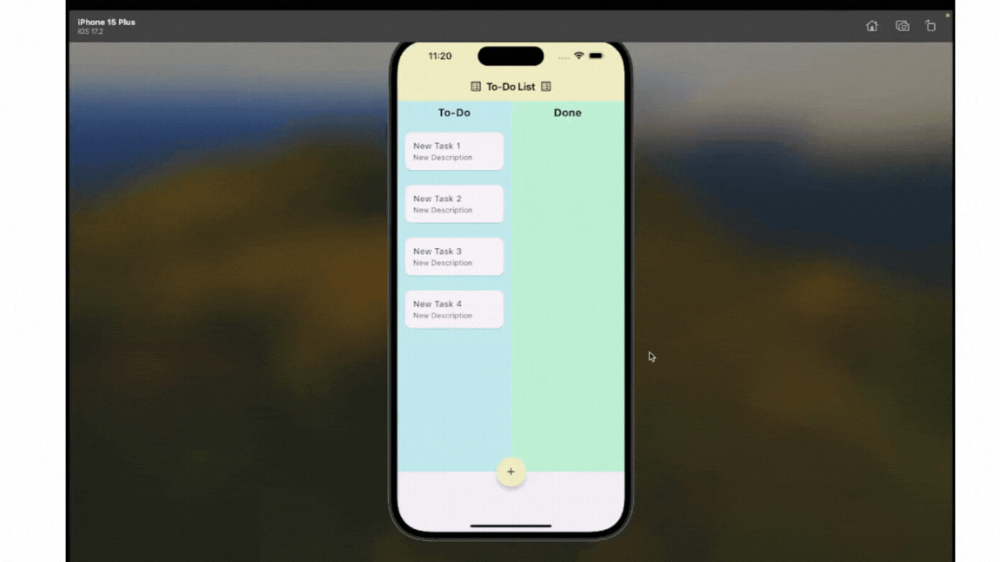

# to_do_list_app

Bu uygulama, Flutter Draggable Widget'ını kullanabilmek için geliştirdiğim bir to-do list uygulamasıdır.

Bitirilen task'ları to-do'dan done'a sürükleyebilmeyi amaçlar.

Aynı zamanda task'ların düzenlenebilmesi ve silinebilmesi gibi özellikler sağlar.

1. **Kurulum**
   
   Projeyi klonlayın ve gerekli paketleri yükleyin:
   ```bash
   git clone https://github.com/melikeyogurtcu/Flutter-Draggable.git  
2. **Gerekli paketleri yükleyin:**

    ```bash
   flutter pub get

## Görseller

|  |  |  |
|----------------------------------|---------------------------------|-------------------------------|
|      |  |

## Test Etme



